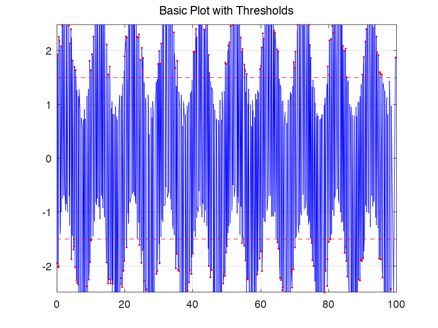
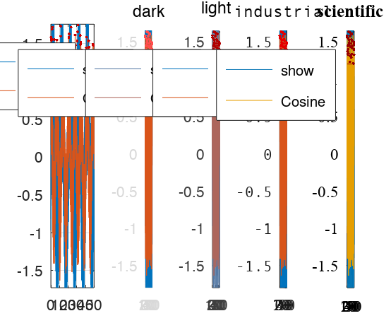
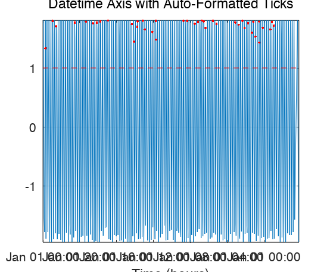
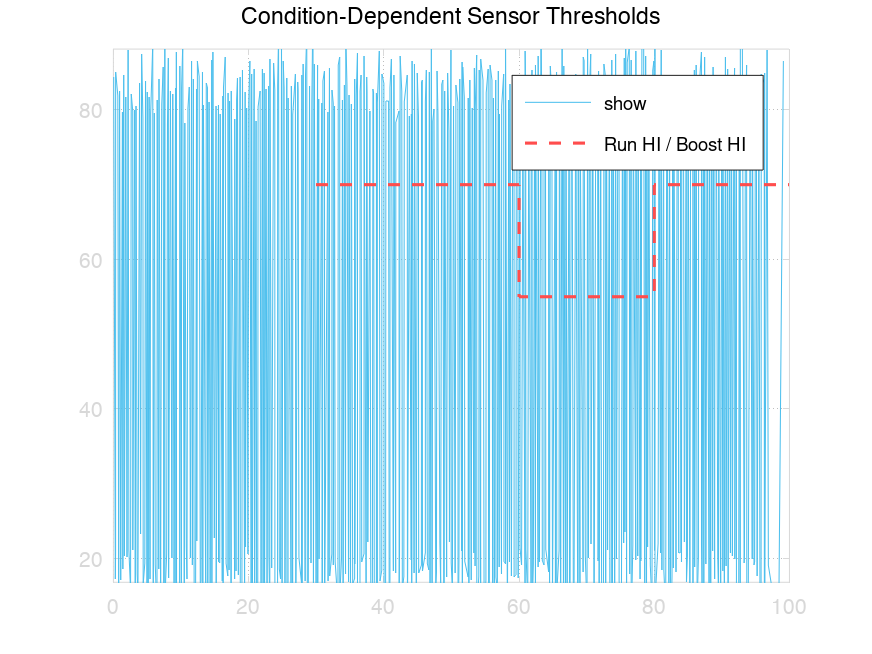
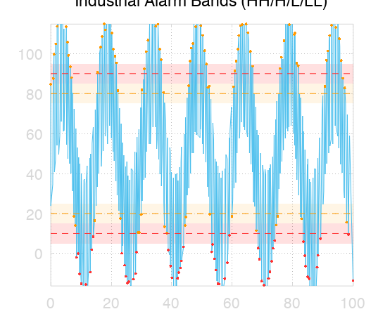
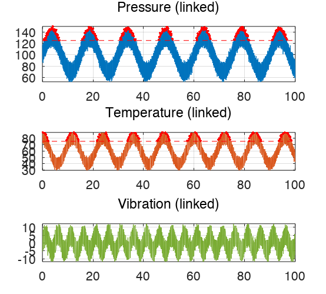
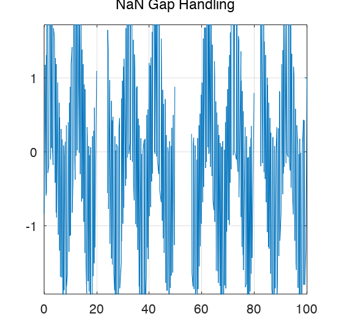

# FastPlot

[](LICENSE)
[](https://www.mathworks.com/products/matlab.html)
[](https://octave.org)
[](#running-tests)

Ultra-fast time series plotting for MATLAB and GNU Octave. Plot 100M+ data points with fluid zoom and pan.

FastPlot dynamically downsamples your data to screen resolution on every zoom/pan interaction. Instead of pushing millions of points to the GPU, it renders only ~4000 points — preserving visual fidelity while keeping the UI responsive.

## Table of Contents

- [Why FastPlot?](#why-fastplot)
- [Performance](#performance)
- [Quick Start](#quick-start)
  - [Dashboard Layout](#dashboard-layout)
  - [Theming](#theming)
  - [Toolbar](#toolbar)
  - [Datetime Axes](#datetime-axes)
  - [Sensor Thresholds](#sensor-thresholds)
- [Installation](#installation)
  - [Optional: Build MEX Accelerators](#optional-build-mex-accelerators)
- [Requirements](#requirements)
- [API Reference](#api-reference)
  - [`FastPlot()` — Constructor](#fastplot--constructor)
  - [`addLine(x, y, ...)` — Add a Data Line](#addlinex-y---add-a-data-line)
  - [`addThreshold(value, ...)` — Add a Threshold Line](#addthresholdvalue---add-a-threshold-line)
  - [`addBand(yLow, yHigh, ...)` — Horizontal Band Fill](#addbandylow-yhigh---horizontal-band-fill)
  - [`addShaded(x, y1, y2, ...)` — Fill Between Curves](#addshadedx-y1-y2---fill-between-curves)
  - [`addFill(x, y, ...)` — Area Fill to Baseline](#addfillx-y---area-fill-to-baseline)
  - [`addMarker(x, y, ...)` — Custom Event Markers](#addmarkerx-y---custom-event-markers)
  - [`addSensor(sensor, ...)` — Add a Sensor Object](#addsensorsensor---add-a-sensor-object)
  - [`setScale(...)` — Change Axis Scale](#setscale--change-axis-scale)
  - [`render()` — Render the Plot](#render--render-the-plot)
  - [Live Mode](#live-mode)
  - [Properties](#properties-read-only-after-render)
  - [`FastPlotFigure(rows, cols, ...)` — Dashboard Layout](#fastplotfigurerows-cols---dashboard-layout)
  - [`FastPlotDock(...)` — Tabbed Container](#fastplotdock--tabbed-container)
  - [`Sensor(key, ...)` — Sensor Data Object](#sensorkey---sensor-data-object)
  - [`ThresholdRule(condition, value, ...)` — Condition-Dependent Threshold](#thresholdrulecondition-value---condition-dependent-threshold)
  - [`StateChannel(key)` — Time-Varying State](#statechannelkey--time-varying-state)
  - [`SensorRegistry` — Predefined Sensor Catalog](#sensorregistry--predefined-sensor-catalog)
  - [`FastPlotTheme(preset, ...)` — Theme Presets](#fastplotthemepreset---theme-presets)
- [Event Detection](#event-detection)
  - [Quick Start — Live Pipeline](#quick-start--live-pipeline)
  - [Event Detection API](#event-detection-api)
    - [`EventDetector` — Threshold Violation Grouping](#eventdetector--threshold-violation-grouping)
    - [`IncrementalEventDetector` — Streaming Detection](#incrementaleventdetector--streaming-detection)
    - [`Event` — Detected Event](#event--detected-event)
    - [`EventStore` — Atomic Persistence](#eventstore--atomic-persistence)
    - [`LiveEventPipeline` — Orchestrator](#liveeventpipeline--orchestrator)
    - [`EventViewer` — Interactive Gantt + Table](#eventviewer--interactive-gantt--table)
    - [`NotificationService` — Rule-Based Alerts](#notificationservice--rule-based-alerts)
    - [Data Sources](#data-sources)
- [Linked Axes](#linked-axes)
- [Handling NaN Gaps](#handling-nan-gaps)
- [Uneven Sampling](#uneven-sampling)
- [Examples](#examples)
- [Architecture](#architecture)
- [Running Tests](#running-tests)
- [Benchmarks](#benchmarks)
- [License](#license)

## Why FastPlot?

| | Standard `plot()` | FastPlot |
|---|---|---|
| 10M points render | Pushes all 10M to GPU | Downsamples to ~4K points |
| GPU memory | 153 MB | 0.06 MB |
| Zoom interaction | Re-renders all points | Binary search + re-downsample visible range |
| Threshold markers | Manual implementation | Built-in with violation highlighting |
| Linked subplots | `linkaxes` (no re-downsample) | Synchronized zoom with per-subplot re-downsample |

## Performance

Benchmarked on Apple M4 with GNU Octave 11, 10M data points:

| Operation | Time |
|---|---|
| MinMax downsample (MEX) | 7.4 ms |
| Full zoom cycle (2 thresholds) | 4.7 ms |
| Effective zoom FPS | **212 FPS** |
| Point reduction | 99.96% |

## Quick Start

```matlab
setup;  % adds libs/FastPlot and libs/SensorThreshold to path

% Generate data
x = linspace(0, 100, 1e7);
y = sin(x * 2*pi / 10) + 0.5 * randn(1, numel(x));

% Plot with thresholds
fp = FastPlot();
fp.addLine(x, y, 'DisplayName', 'Sensor1', 'Color', 'b');
fp.addThreshold(1.5, 'Direction', 'upper', 'ShowViolations', true, 'Color', 'r');
fp.addThreshold(-1.5, 'Direction', 'lower', 'ShowViolations', true, 'Color', 'r');
fp.render();
```

Zoom and pan interactively — FastPlot re-downsamples automatically.



### Dashboard Layout

```matlab
fig = FastPlotFigure(2, 2, 'Theme', 'dark');
fig.setTileSpan(1, [1 2]);  % tile 1 spans both columns

fp1 = fig.tile(1);
fp1.addLine(x, temperature);
fp1.addBand(85, 95, 'FaceColor', [1 0.3 0.3], 'FaceAlpha', 0.15);
fp1.addThreshold(90, 'Direction', 'upper', 'ShowViolations', true);

fp2 = fig.tile(3);
fp2.addLine(x, pressure);
fp2.addShaded(x, upper_bound, lower_bound, 'FaceColor', [0.3 0.7 1]);

fig.renderAll();
fig.tileTitle(1, 'Temperature');
```


### Theming

```matlab
fp = FastPlot('Theme', 'dark');       % 5 presets: default, dark, light, industrial, scientific
fp = FastPlot('Theme', struct('Background', [0 0 0], 'FontSize', 14));  % custom overrides
```



### Toolbar

Attach an interactive toolbar to any FastPlot or FastPlotFigure:

```matlab
fp = FastPlot('Theme', 'dark');
fp.addLine(x, y1, 'DisplayName', 'Sine');
fp.addLine(x, y2, 'DisplayName', 'Cosine');
fp.render();
tb = FastPlotToolbar(fp);

% Also works with dashboards
fig = FastPlotFigure(1, 2);
% ... add lines, render ...
tb = FastPlotToolbar(fig);
```

**Toolbar buttons:** Data Cursor (click to snap), Crosshair (hover tracking), Toggle Grid, Toggle Legend, Autoscale Y (fits visible data), Export PNG, Refresh Data, Live Mode toggle.

**Programmatic API:**

```matlab
tb.toggleGrid();           % toggle grid on all axes
tb.toggleLegend();         % toggle legend on all axes
tb.autoscaleY();           % fit Y to visible X range
tb.exportPNG('out.png');   % export at 150 DPI
tb.setCrosshair(true);     % enable crosshair mode
tb.setCursor(true);        % enable data cursor mode
```

### Datetime Axes

Pass `datenum` values as X data with `'XType', 'datenum'` to get auto-formatted date/time tick labels:

```matlab
x = datenum(2024,1,1) + (0:99999)/86400;  % 1-second resolution
y = sin((1:100000) * 2*pi/3600);

fp = FastPlot();
fp.addLine(x, y, 'XType', 'datenum');
fp.render();
```

Tick labels auto-adapt to zoom level: `Jan 15 10:00` when zoomed out, `10:30:15` when zoomed in. The toolbar crosshair and data cursor also display datetime values.



In MATLAB, you can also pass `datetime` objects directly — they are auto-converted to `datenum`:

```matlab
dt = datetime(2024,1,1) + hours(0:999);
fp.addLine(dt, y);  % XType set automatically
```

### Sensor Thresholds

Define sensors with condition-dependent thresholds that change based on machine state:

```matlab
setup;

% Create a sensor with state-dependent thresholds
s = Sensor('pressure', 'Name', 'Chamber Pressure');
s.X = linspace(0, 100, 1e6);
s.Y = randn(1, 1e6) * 10 + 50;

% Add a state channel (e.g., machine mode)
sc = StateChannel('machine');
sc.X = [0 30 60 80];
sc.Y = [0 1 2 1];     % idle=0, run=1, boost=2
s.addStateChannel(sc);

% Thresholds that depend on machine state
s.addThresholdRule(struct('machine', 1), 70, 'Direction', 'upper', 'Label', 'Run HI');
s.addThresholdRule(struct('machine', 2), 55, 'Direction', 'upper', 'Label', 'Boost HI');
s.resolve();

% Plot with one call
fp = FastPlot('Theme', 'dark');
fp.addSensor(s);
fp.render();
```



Use `SensorRegistry` for predefined sensor catalogs:

```matlab
SensorRegistry.list();                            % quick overview
SensorRegistry.printTable();                      % detailed console table
hFig = SensorRegistry.viewer();                   % GUI table viewer
s = SensorRegistry.get('pressure');               % retrieve by key
sensors = SensorRegistry.getMultiple({'pressure', 'temperature'});
```

## Installation

```bash
git clone https://github.com/HanSur94/FastPlot.git
```

```matlab
cd FastPlot
setup;
```

No toolbox dependencies. Works out of the box with pure MATLAB code.

### Optional: Build MEX Accelerators

For maximum performance, compile the C MEX files with SIMD intrinsics:

```matlab
cd FastPlot/libs/FastPlot
build_mex()
```

```
Architecture: arm64 (darwin25.2.0-aarch64)
Compiler: gcc-15 (GCC — preferred for auto-vectorization)
SIMD target: ARM NEON

Compiling binary_search_mex.c ... OK
Compiling minmax_core_mex.c ... OK
Compiling lttb_core_mex.c ... OK
Compiling compute_violations_mex.c ... OK

4/4 MEX files compiled successfully.
```

Requires a C compiler (Xcode on macOS, GCC on Linux, MSVC on Windows). The build script auto-detects GCC for better optimization and falls back to the system compiler. Uses AVX2 on x86_64 and NEON on ARM64.

If MEX files are not compiled, FastPlot automatically uses the pure-MATLAB implementations — no functionality is lost.

## Requirements

- MATLAB R2020b+ or GNU Octave 7+
- C compiler (optional, for MEX acceleration)

## API Reference

### `FastPlot()` — Constructor

```matlab
fp = FastPlot();
fp = FastPlot('Parent', axesHandle);
fp = FastPlot('LinkGroup', 'group1');
fp = FastPlot('Theme', 'dark');
fp = FastPlot('Theme', struct('Background', [0 0 0]));
```

| Parameter | Type | Description |
|-----------|------|-------------|
| `Parent` | axes handle | Embed in existing axes (for subplots) |
| `LinkGroup` | string | ID for synchronized zoom/pan across instances |
| `Theme` | string or struct | Theme preset name or custom theme struct |
| `XScale` | `'linear'` or `'log'` | X-axis scale (default `'linear'`) |
| `YScale` | `'linear'` or `'log'` | Y-axis scale (default `'linear'`) |
| `DefaultDownsampleMethod` | `'minmax'` or `'lttb'` | Default downsampling for all lines |
| `DownsampleFactor` | integer | Points per pixel (default 2) |
| `LiveInterval` | double | Polling interval in seconds for live mode |
| `Verbose` | logical | Print diagnostics |

### `addLine(x, y, ...)` — Add a Data Line

```matlab
fp.addLine(x, y);
fp.addLine(x, y, 'DisplayName', 'Pressure', 'Color', [0 0.45 0.74], 'LineWidth', 1.5);
fp.addLine(x, y, 'DownsampleMethod', 'lttb');
```

| Parameter | Type | Default | Description |
|-----------|------|---------|-------------|
| `x` | double vector | (required) | Monotonically increasing X data |
| `y` | double vector | (required) | Y data (same length as x, NaN allowed) |
| `DisplayName` | string | `''` | Legend label |
| `Color` | RGB triplet or char | auto | Line color |
| `LineWidth` | scalar | `0.5` | Line width |
| `DownsampleMethod` | `'minmax'` or `'lttb'` | `'minmax'` | Downsampling algorithm |

Any standard MATLAB line property can be passed as a name-value pair.

**Downsampling methods:**
- **MinMax** (default) — Preserves exact min/max per pixel bucket. Best for detecting peaks, spikes, and threshold violations. Output is 2x the bucket count.
- **LTTB** (Largest Triangle Three Buckets) — Preserves visual shape by selecting points that maximize triangle area. Better for smooth signals where shape matters more than extremes.

### `addThreshold(value, ...)` — Add a Threshold Line

```matlab
fp.addThreshold(4.5);
fp.addThreshold(4.5, 'Direction', 'upper', 'ShowViolations', true, 'Color', 'r');
fp.addThreshold(-2.0, 'Direction', 'lower', 'ShowViolations', true, 'Color', [1 0.5 0], 'LineStyle', ':');
```

| Parameter | Type | Default | Description |
|-----------|------|---------|-------------|
| `value` | scalar | (required) | Threshold Y value |
| `Direction` | `'upper'` or `'lower'` | `'upper'` | Violation direction |
| `ShowViolations` | logical | `false` | Show circle markers at violations |
| `Color` | RGB triplet or char | `[0.8 0 0]` | Line and marker color |
| `LineStyle` | string | `'--'` | Line style |
| `Label` | string | `''` | Legend label |

### `addBand(yLow, yHigh, ...)` — Horizontal Band Fill

```matlab
fp.addBand(85, 95, 'FaceColor', [1 0.3 0.3], 'FaceAlpha', 0.15, 'Label', 'High Alarm');
```

| Parameter | Type | Default | Description |
|-----------|------|---------|-------------|
| `yLow` | scalar | (required) | Lower Y bound |
| `yHigh` | scalar | (required) | Upper Y bound |
| `FaceColor` | RGB triplet | theme ThresholdColor | Fill color |
| `FaceAlpha` | scalar | theme BandAlpha | Fill transparency |
| `EdgeColor` | RGB or `'none'` | `'none'` | Edge color |
| `Label` | string | `''` | Label for the band |



### `addShaded(x, y1, y2, ...)` — Fill Between Curves

```matlab
fp.addShaded(x, upper_bound, lower_bound, 'FaceColor', [0 0.5 1], 'FaceAlpha', 0.2);
```

| Parameter | Type | Default | Description |
|-----------|------|---------|-------------|
| `x` | double vector | (required) | Monotonically increasing X data |
| `y1` | double vector | (required) | Upper curve Y data |
| `y2` | double vector | (required) | Lower curve Y data |
| `FaceColor` | RGB triplet | `[0 0.45 0.74]` | Fill color |
| `FaceAlpha` | scalar | `0.15` | Fill transparency |

Shaded regions are downsampled on zoom, just like data lines.

### `addFill(x, y, ...)` — Area Fill to Baseline

```matlab
fp.addFill(x, y, 'Baseline', 0, 'FaceColor', [0 0.5 1], 'FaceAlpha', 0.2);
```

Sugar for `addShaded` — fills from the curve `y` down to a constant baseline (default 0).

### `addMarker(x, y, ...)` — Custom Event Markers

```matlab
fp.addMarker([50 150 250], [3 3 3], 'Marker', 'v', 'MarkerSize', 10, 'Color', [1 0 0]);
```

| Parameter | Type | Default | Description |
|-----------|------|---------|-------------|
| `x` | double vector | (required) | Marker X positions |
| `y` | double vector | (required) | Marker Y positions |
| `Marker` | char | `'o'` | Marker shape |
| `MarkerSize` | scalar | `6` | Marker size |
| `Color` | RGB triplet | theme ThresholdColor | Marker color |
| `Label` | string | `''` | Label for the markers |

### `addSensor(sensor, ...)` — Add a Sensor Object

```matlab
fp.addSensor(s);
fp.addSensor(s, 'ShowThresholds', true);
fp.addSensor(s, 'ShowThresholds', false);
```

Adds a resolved `Sensor`'s data line and its resolved threshold step-function lines and violation markers in one call. The sensor must have `X` and `Y` set and `resolve()` called before adding.

| Parameter | Type | Default | Description |
|-----------|------|---------|-------------|
| `sensor` | Sensor | (required) | A resolved Sensor object |
| `ShowThresholds` | logical | `true` | Also plot resolved threshold lines |

### `setScale(...)` — Change Axis Scale

```matlab
fp.setScale('YScale', 'log');
fp.setScale('XScale', 'log', 'YScale', 'linear');
```

Can be called before or after `render()`. After render, updates the axes and re-downsamples all lines with scale-aware bucket spacing.

### `render()` — Render the Plot

```matlab
fp.render();
```

Must be called after all lines and thresholds are added. Creates the figure, performs initial downsampling, installs zoom/pan listeners, and draws everything.

### Live Mode

```matlab
fp.startLive('data.mat', @(fp, s) fp.updateData(1, s.x, s.y));
fp.startLive('data.mat', updateFcn, 'Interval', 2, 'ViewMode', 'follow');
fp.stopLive();
fp.updateData(lineIdx, newX, newY);
```

Polls a `.mat` file for changes and auto-refreshes. View modes: `'preserve'` (keep current view), `'follow'` (scroll to latest), `'reset'` (show all).

### Properties (read-only after render)

| Property | Description |
|----------|-------------|
| `fp.hFigure` | Handle to the figure window |
| `fp.hAxes` | Handle to the axes |
| `fp.Lines(i).hLine` | Handle to the i-th line graphics object |

### `FastPlotFigure(rows, cols, ...)` — Dashboard Layout

```matlab
fig = FastPlotFigure(2, 2);
fig = FastPlotFigure(2, 2, 'Theme', 'dark', 'Name', 'Dashboard');
fig = FastPlotFigure(rows, cols, 'ParentFigure', hFig);
```

| Parameter | Type | Description |
|-----------|------|-------------|
| `rows` | integer | Number of tile rows |
| `cols` | integer | Number of tile columns |
| `Theme` | string or struct | Theme applied to all tiles |
| `ParentFigure` | figure handle | Share an existing figure (for docking) |

**Methods:**

| Method | Description |
|--------|-------------|
| `fig.tile(n)` | Get/create FastPlot for tile n (lazy, returns same instance on repeat calls) |
| `fig.setTileSpan(n, [rows cols])` | Set row/column span for tile n |
| `fig.setTileTheme(n, struct(...))` | Override theme fields for tile n |
| `fig.renderAll()` | Render all tiles, show figure |
| `fig.tileTitle(n, str)` | Set title for tile n |
| `fig.tileXLabel(n, str)` | Set X label for tile n |
| `fig.tileYLabel(n, str)` | Set Y label for tile n |

Theme inheritance: element override > tile theme > figure theme > 'default' preset.

### `FastPlotDock(...)` — Tabbed Container

```matlab
dock = FastPlotDock();
dock = FastPlotDock('Theme', 'dark', 'Name', 'My Dock', 'Position', [50 50 1400 800]);
```

| Parameter | Type | Description |
|-----------|------|-------------|
| `Theme` | string or struct | Theme preset name or custom theme struct |
| Any figure property | varies | Passed through to the underlying `figure()` call |

**Methods:**

| Method | Description |
|--------|-------------|
| `dock.addTab(fig, name)` | Register a FastPlotFigure as a tab (works before or after render) |
| `dock.render()` | Render all tabs, create tab bar, show first tab |
| `dock.selectTab(n)` | Switch to tab n |
| `dock.recomputeLayout()` | Recalculate all tile positions (called automatically on resize) |

Each tab's `FastPlotFigure` should be created with `'ParentFigure', dock.hFigure` to share the dock's window.

### `Sensor(key, ...)` — Sensor Data Object

```matlab
s = Sensor('pressure');
s = Sensor('pressure', 'Name', 'Chamber Pressure', 'ID', 101);
s = Sensor('pressure', 'MatFile', 'data.mat', 'KeyName', 'p_chamber');
```

| Parameter | Type | Description |
|-----------|------|-------------|
| `key` | string | Unique sensor identifier |
| `Name` | string | Human-readable display name |
| `ID` | numeric | Sensor ID |
| `MatFile` | string | Path to .mat file |
| `KeyName` | string | Field name in .mat file (defaults to `key`) |

**Methods:**

| Method | Description |
|--------|-------------|
| `s.addStateChannel(sc)` | Attach a `StateChannel` to this sensor |
| `s.addThresholdRule(cond, val, ...)` | Add a condition-dependent threshold rule |
| `s.resolve()` | Precompute threshold time series, violations, and state bands |

### `ThresholdRule(condition, value, ...)` — Condition-Dependent Threshold

```matlab
rule = ThresholdRule(struct('machine', 1), 50);
rule = ThresholdRule(struct(), 50);  % empty condition = always active
rule = ThresholdRule(struct('machine', 1), 50, 'Direction', 'upper', 'Label', 'HH');
```

| Parameter | Type | Default | Description |
|-----------|------|---------|-------------|
| `condition` | struct | (required) | State keys/values that activate this rule |
| `value` | scalar | (required) | Threshold value |
| `Direction` | `'upper'` or `'lower'` | `'upper'` | Violation direction |
| `Label` | string | `''` | Display label |
| `Color` | RGB triplet | `[]` | Override color (empty = use theme) |

### `StateChannel(key)` — Time-Varying State

```matlab
sc = StateChannel('machine');
sc.X = [0 20 40 60];     % time points
sc.Y = [0 1 2 1];        % state values at those times
s.addStateChannel(sc);
```

### `SensorRegistry` — Predefined Sensor Catalog

```matlab
SensorRegistry.list();                            % print all available sensors
SensorRegistry.printTable();                      % detailed table (Key, Name, ID, Source, MatFile, #States, #Rules, #Points)
hFig = SensorRegistry.viewer();                   % open GUI table viewer
s = SensorRegistry.get('pressure');               % retrieve by key
sensors = SensorRegistry.getMultiple({'pressure', 'temperature'});
```

**`printTable()`** prints a formatted console table with columns: Key, Name, ID, Source, MatFile, #States, #Rules, #Points.

**`viewer()`** opens a dark-themed GUI figure with a sortable `uitable` showing all registered sensors and their properties. Returns the figure handle.

### `FastPlotTheme(preset, ...)` — Theme Presets

```matlab
t = FastPlotTheme('dark');
t = FastPlotTheme('default', 'FontSize', 14, 'LineWidth', 2.0);
t = FastPlotTheme(struct('Background', [0 0 0]));  % struct merged with defaults
```

**Built-in presets:** `default`, `dark`, `light`, `industrial`, `scientific`

**Color palettes:** `vibrant` (default), `muted`, `colorblind` (Wong 2011)

| Field | Description |
|-------|-------------|
| `Background` | Figure background color |
| `AxesColor` | Axes background color |
| `ForegroundColor` | Text and axis color |
| `GridColor`, `GridAlpha`, `GridStyle` | Grid appearance |
| `FontName`, `FontSize`, `TitleFontSize` | Typography |
| `LineWidth` | Default line width |
| `LineColorOrder` | Nx3 color matrix or palette name |
| `ThresholdColor`, `ThresholdStyle` | Default threshold appearance |
| `ViolationMarker`, `ViolationSize` | Violation marker defaults |
| `BandAlpha` | Default band fill transparency |

Lines are auto-colored from `LineColorOrder` — no need to specify colors manually.

## Event Detection

FastPlot includes a full event detection pipeline that monitors sensor data for threshold violations, groups them into events, and provides interactive visualization, persistence, and notifications.

### Quick Start — Live Pipeline

```matlab
setup;

% 1. Define sensors with warning/alarm thresholds
tempSensor = Sensor('temperature', 'Name', 'Chamber Temperature');
sc = StateChannel('mode');
tempSensor.addStateChannel(sc);

% State-dependent thresholds: different limits for idle vs heating
tempSensor.addThresholdRule(struct('mode', 'idle'), 120, ...
    'Direction', 'upper', 'Label', 'H Warning', ...
    'Color', [1 0.75 0], 'LineStyle', '--');
tempSensor.addThresholdRule(struct('mode', 'idle'), 150, ...
    'Direction', 'upper', 'Label', 'HH Alarm', ...
    'Color', [1 0 0], 'LineStyle', '-');

sensors = containers.Map();
sensors('temperature') = tempSensor;

% 2. Configure data sources
dsMap = DataSourceMap();
dsMap.add('temperature', MockDataSource( ...
    'BaseValue', 85, 'NoiseStd', 2, ...
    'ViolationProbability', 0.0001, ...
    'ViolationAmplitude', 38, ...
    'BacklogDays', 2, 'SampleInterval', 3, ...
    'StateValues', {{'idle', 'heating', 'cooling'}}, ...
    'StateChangeProbability', 0.002, 'Seed', 42));

% 3. Create pipeline
storeFile = fullfile(tempdir, 'events.mat');
pipeline = LiveEventPipeline(sensors, dsMap, ...
    'EventFile', storeFile, 'Interval', 15, ...
    'EscalateSeverity', true, 'MaxBackups', 3);

% 4. Add notifications (dry-run logs to console)
notif = NotificationService('DryRun', true);
notif.addRule(NotificationRule( ...
    'SensorKey', 'temperature', ...
    'Recipients', {{'thermal-team@company.com'}}, ...
    'Subject', '[THERMAL] {sensor}: {threshold}', ...
    'Message', 'Peak: {peak}. Duration: {duration}.', ...
    'IncludeSnapshot', true));
pipeline.NotificationService = notif;

% 5. Run — manual cycles or timer-driven
pipeline.runCycle();         % single cycle
pipeline.start();            % start 15s timer

% 6. View results
viewer = EventViewer.fromFile(storeFile);
viewer.startAutoRefresh(15);
```

See `example_live_pipeline.m` for the full working demo with 3 sensors, state-dependent thresholds, and all features.

### Event Detection API

#### `EventDetector` — Threshold Violation Grouping

```matlab
det = EventDetector('MinDuration', 0, 'MaxCallsPerEvent', 1);
events = detectEventsFromSensor(sensor, det);
```

Groups threshold violations from a resolved `Sensor` into discrete `Event` objects. Adjacent violations of the same threshold are merged. Events shorter than `MinDuration` are filtered out.

#### `IncrementalEventDetector` — Streaming Detection

```matlab
det = IncrementalEventDetector('MinDuration', 0, 'EscalateSeverity', true);
newEvents = det.process(sensorKey, sensor, newX, newY, stateX, stateY);
```

Wraps `EventDetector` for incremental use — maintains state across calls, carries over open events between batches, and merges events that span batch boundaries. Supports severity escalation (e.g., H Warning → HH Alarm when peak exceeds the higher threshold).

| Parameter | Type | Default | Description |
|-----------|------|---------|-------------|
| `MinDuration` | double | `0` | Minimum event duration in datenum days |
| `EscalateSeverity` | logical | `true` | Upgrade severity when peak exceeds higher threshold |
| `MaxCallsPerEvent` | integer | `1` | Max notification calls per event |
| `OnEventStart` | function handle | `[]` | Callback fired for each completed event |

#### `Event` — Detected Event

```matlab
ev = Event(startTime, endTime, sensorName, thresholdLabel, thresholdValue, direction);
ev = ev.setStats(peakVal, nPts, minVal, maxVal, meanVal, rmsVal, stdVal);
ev = ev.escalateTo(newLabel, newThresholdValue);
```

| Property | Description |
|----------|-------------|
| `StartTime`, `EndTime` | Event boundaries (datenum) |
| `Duration` | `EndTime - StartTime` (datenum days) |
| `SensorName` | Sensor key string |
| `ThresholdLabel` | e.g., `'H Warning'`, `'HH Alarm'` |
| `ThresholdValue` | Threshold value that was violated |
| `Direction` | `'high'` or `'low'` |
| `PeakValue` | Extreme value during the event |
| `NumPoints`, `MinValue`, `MaxValue`, `MeanValue`, `RmsValue`, `StdValue` | Statistics |

#### `EventStore` — Atomic Persistence

```matlab
store = EventStore('events.mat', 'MaxBackups', 3);
store.append(newEvents);
store.save();
[events, meta] = EventStore.loadFile('events.mat');
```

Atomic write with backup rotation. Each `save()` creates a timestamped backup before overwriting. Also stores sensor time series data for EventViewer click-to-plot.

| Parameter | Type | Default | Description |
|-----------|------|---------|-------------|
| `filepath` | string | (required) | Path to the .mat store file |
| `MaxBackups` | integer | `5` | Number of backup copies to retain |

#### `LiveEventPipeline` — Orchestrator

```matlab
pipeline = LiveEventPipeline(sensors, dataSourceMap, ...
    'EventFile', 'events.mat', 'Interval', 15, ...
    'EscalateSeverity', true, 'MaxBackups', 3);
pipeline.start();      % timer-driven
pipeline.stop();
pipeline.runCycle();   % manual single cycle
```

Orchestrates the full loop: fetch new data → detect events → persist to store → send notifications. Runs on a configurable timer or can be called manually.

| Parameter | Type | Default | Description |
|-----------|------|---------|-------------|
| `sensors` | containers.Map | (required) | Sensor key → `Sensor` object |
| `dataSourceMap` | DataSourceMap | (required) | Sensor key → data source |
| `EventFile` | string | `''` | Path to EventStore .mat file |
| `Interval` | double | `15` | Timer interval in seconds |
| `MinDuration` | double | `0` | Passed to IncrementalEventDetector |
| `EscalateSeverity` | logical | `true` | Passed to IncrementalEventDetector |
| `MaxBackups` | integer | `5` | Passed to EventStore |

#### `EventViewer` — Interactive Gantt + Table

```matlab
viewer = EventViewer(events);
viewer = EventViewer(events, sensorData, thresholdColors);
viewer = EventViewer.fromFile('events.mat');
viewer.startAutoRefresh(15);
```

Interactive figure with:
- **Gantt timeline** — color-coded bars per sensor/threshold, hover tooltips, click to highlight
- **Filterable table** — sensor and threshold dropdown filters, datetime-formatted columns, readable durations
- **Click-to-plot** — double-click a table row to open a FastPlotFigure dashboard with zoomed event detail + full sensor timeline with selection rectangle
- **Bidirectional selection** — clicking a Gantt bar highlights the table row (with scroll); clicking a table row highlights the Gantt bar
- **Auto-refresh** — polls the store file on a timer, with manual refresh button

| Method | Description |
|--------|-------------|
| `EventViewer.fromFile(path)` | Open from a saved .mat event store |
| `viewer.update(events)` | Update with new events |
| `viewer.startAutoRefresh(sec)` | Start polling the store file |
| `viewer.stopAutoRefresh()` | Stop polling |
| `viewer.refreshFromFile()` | Manual one-shot refresh |

#### `NotificationService` — Rule-Based Alerts

```matlab
notif = NotificationService('DryRun', true, 'SnapshotDir', '/tmp/snapshots');
notif.addRule(NotificationRule( ...
    'SensorKey', 'temperature', ...
    'ThresholdLabel', 'HH Alarm', ...
    'Recipients', {{'safety@company.com'}}, ...
    'Subject', 'CRITICAL: {sensor} {threshold}!', ...
    'Message', 'Peak: {peak}. Duration: {duration}.', ...
    'IncludeSnapshot', true));
notif.setDefaultRule(NotificationRule(...));
notif.notify(event, sensorData);
```

Priority-based rule matching: exact match (sensor + threshold, score=3) > sensor match (score=2) > default (score=1). Template variables: `{sensor}`, `{threshold}`, `{direction}`, `{startTime}`, `{endTime}`, `{peak}`, `{mean}`, `{std}`, `{duration}`.

When `IncludeSnapshot` is true, generates detail + context PNG plots via `generateEventSnapshot`.

#### Data Sources

```matlab
% Mock data with configurable violations, drift, and state changes
ds = MockDataSource('BaseValue', 85, 'NoiseStd', 2, ...
    'ViolationProbability', 0.0001, 'ViolationAmplitude', 38, ...
    'BacklogDays', 2, 'SampleInterval', 3, 'Seed', 42);

% Read from a continuously-updated .mat file
ds = MatFileDataSource('data.mat', 'XVar', 't', 'YVar', 'y');

% Map sensor keys to swappable data sources
dsMap = DataSourceMap();
dsMap.add('temperature', ds);
result = dsMap.get('temperature').fetchNew();
```

All data sources implement `fetchNew()` which returns a struct with fields `X`, `Y`, `stateX`, `stateY`, and `changed`.

## Linked Axes

Synchronize zoom and pan across multiple subplots:

```matlab
fig = figure('Position', [100 100 1200 800]);

% Top subplot
ax1 = subplot(2, 1, 1, 'Parent', fig);
fp1 = FastPlot('Parent', ax1, 'LinkGroup', 'sensors');
fp1.addLine(x, pressure, 'DisplayName', 'Pressure', 'Color', 'b');
fp1.render();

% Bottom subplot
ax2 = subplot(2, 1, 2, 'Parent', fig);
fp2 = FastPlot('Parent', ax2, 'LinkGroup', 'sensors');
fp2.addLine(x, temperature, 'DisplayName', 'Temperature', 'Color', 'r');
fp2.render();
```

Zooming on either subplot updates the other. Each subplot re-downsamples independently.



## Handling NaN Gaps

FastPlot handles missing data natively. NaN values in Y create visual gaps:

```matlab
y = sin(x);
y(1000:2000) = NaN;  % Sensor dropout
y(5000:5500) = NaN;  % Another gap

fp = FastPlot();
fp.addLine(x, y, 'DisplayName', 'Sensor');
fp.render();
```

Each contiguous non-NaN segment is downsampled independently and rejoined with NaN separators.



## Uneven Sampling

No uniform spacing assumption. FastPlot works with any monotonically increasing X:

```matlab
% Event-driven acquisition: sparse monitoring + dense bursts
x_sparse = linspace(0, 100, 1000);      % 10 Hz
x_dense = linspace(30, 30.1, 10000);    % 100 kHz burst
x = sort([x_sparse, x_dense]);
y = interp1(x_sparse, randn(size(x_sparse)), x);

fp = FastPlot();
fp.addLine(x, y, 'DisplayName', 'Events');
fp.render();
```

## Examples

| Example | Description |
|---------|-------------|
| `example_basic.m` | 10M noisy sine wave with alarm thresholds |
| `example_100M.m` | 100M point stress test |
| `example_multi.m` | 5 sensor lines with shared threshold |
| `example_linked.m` | 3 linked subplots (pressure, temperature, vibration) |
| `example_nan_gaps.m` | Missing data with sensor dropouts |
| `example_alarm_bands.m` | Industrial 4-level alarm bands (HH/H/L/LL) |
| `example_lttb_vs_minmax.m` | Side-by-side downsampling comparison |
| `example_vibration.m` | 20M accelerometer data at 50 kHz |
| `example_ecg.m` | 5M ECG signal with arrhythmia detection |
| `example_multi_sensor_linked.m` | 4-channel linked monitoring dashboard |
| `example_uneven_sampling.m` | Variable-rate event-driven data |
| `example_dashboard.m` | Tiled dashboard with bands, shading, and markers |
| `example_dashboard_9tile.m` | 3x3 tiled dashboard layout |
| `example_themes.m` | All 5 theme presets side by side |
| `example_toolbar.m` | Interactive toolbar with data cursor, crosshair, and export |
| `example_datetime.m` | Datetime X-axis with auto-formatted tick labels |
| `example_dock.m` | Two dashboards docked in a single tabbed window |
| `example_sensor_registry.m` | SensorRegistry API: list, get, getMultiple |
| `example_sensor_static.m` | Static threshold plotting with Sensor objects |
| `example_sensor_threshold.m` | Condition-dependent thresholds |
| `example_sensor_multi_state.m` | Multi-state sensor thresholds |
| `example_sensor_dashboard.m` | Sensor data in a tiled dashboard |
| `example_live_pipeline.m` | Full live event detection pipeline with 3 sensors, state-dependent thresholds, notifications, and EventViewer |
| `example_stress_test.m` | 5-tab dock with 26 sensors and 60M data points |
| `example_visual_features.m` | Visual feature showcase |
| `benchmark.m` | FastPlot vs plot() performance comparison |
| `benchmark_zoom.m` | Per-frame zoom/pan latency analysis |
| `benchmark_features.m` | Feature-specific performance benchmarks |
| `benchmark_resolve.m` | Sensor.resolve() optimization benchmark |

### Interactive demo

Opens all example plots for interactive exploration. Zoom and pan on any figure as long as you want — press Enter to close all and exit:

```matlab
cd FastPlot/examples
demo_all
```

> **Note:** Interactive zoom/pan requires a GUI. In Octave, run from the Octave GUI or use `octave --gui`. The `--no-gui` mode renders plots but does not support interactive mouse zoom/pan.

### Run all examples (non-interactive)

```matlab
cd FastPlot/examples
run_all_examples
```

## Architecture

```
setup.m                               Path setup + MEX compilation
libs/
├── FastPlot/
│   ├── FastPlot.m                    Main class (addLine, addThreshold, addBand, addShaded, addFill, addMarker, addSensor, render)
│   ├── FastPlotFigure.m              Tiled dashboard layout manager (tile, setTileSpan, renderAll)
│   ├── FastPlotDock.m                Tabbed container for multiple dashboards (addTab, selectTab, render)
│   ├── FastPlotToolbar.m             Interactive toolbar (cursor, crosshair, grid, legend, autoscale, export, refresh, live)
│   ├── FastPlotTheme.m               Theme presets and palette system (6 presets, 4 palettes)
│   ├── FastPlotDefaults.m            Default configuration values
│   ├── FastPlotDataStore.m           SQLite-backed chunked storage for 100M+ point datasets
│   ├── SensorDetailPlot.m            Specialized sensor detail view with state bands
│   ├── NavigatorOverlay.m            Minimap zoom navigator overlay
│   ├── ConsoleProgressBar.m          Hierarchical console progress display
│   ├── build_mex.m                   MEX compilation script (auto-detects SIMD)
│   ├── mksqlite.c                    SQLite3 MEX interface with typed BLOB support
│   └── private/
│       ├── binary_search.m           O(log n) find visible range (MEX dispatch)
│       ├── minmax_downsample.m       NaN-aware MinMax downsampling (MEX dispatch)
│       ├── lttb_downsample.m         NaN-aware LTTB downsampling (MEX dispatch)
│       ├── compute_violations.m      Threshold violation detection (MEX dispatch)
│       └── mex_src/
│           ├── simd_utils.h          SIMD abstraction (AVX2/SSE2/NEON/scalar)
│           ├── binary_search_mex.c   Binary search kernel
│           ├── minmax_core_mex.c     MinMax downsampling kernel
│           ├── lttb_core_mex.c       LTTB downsampling kernel
│           ├── compute_violations_mex.c  Violation detection kernel
│           ├── violation_cull_mex.c  Fused detection + pixel culling
│           ├── resolve_disk_mex.c    SQLite disk-based sensor resolution
│           └── build_store_mex.c     Bulk SQLite writer for DataStore init
├── SensorThreshold/
│   ├── Sensor.m                      Sensor data + state channels + threshold rules
│   ├── SensorRegistry.m              Catalog of predefined sensors
│   ├── ThresholdRule.m               Condition-value threshold pairs
│   ├── StateChannel.m                Time-varying state (machine mode, etc.)
│   └── private/                      Segment-based resolution helpers
├── EventDetection/
│   ├── EventDetector.m               Threshold violation → event grouping
│   ├── IncrementalEventDetector.m    Streaming detection with open-event carry-over
│   ├── Event.m                       Event data model with stats and escalation
│   ├── EventStore.m                  Atomic persistence with backup rotation
│   ├── LiveEventPipeline.m           Orchestrator: fetch → detect → store → notify
│   ├── EventViewer.m                 Interactive Gantt timeline + filterable table
│   ├── NotificationService.m         Rule-based alerts with template filling
│   ├── NotificationRule.m            Priority-based rule matching
│   ├── generateEventSnapshot.m       Detail + context PNG generation
│   ├── DataSource.m                  Abstract data source interface
│   ├── DataSourceMap.m               Sensor key → data source mapping
│   ├── MockDataSource.m              Synthetic data with violations and drift
│   ├── MatFileDataSource.m           Read from continuously-updated .mat files
│   ├── detectEventsFromSensor.m      Sensor → event detection entry point
│   ├── printEventSummary.m           Console event table
│   └── private/
│       └── groupViolations.m         Violation grouping helper
└── Dashboard/
    ├── DashboardEngine.m             Top-level dashboard orchestrator
    ├── DashboardLayout.m             Grid positioning and overlap resolution
    ├── DashboardWidget.m             Base widget class
    ├── FastPlotWidget.m              FastPlot-based widget
    ├── DashboardToolbar.m            Dashboard-level controls
    ├── DashboardSerializer.m         JSON persistence
    └── DashboardTheme.m              Dashboard container styling
tests/                                30+ test suites
examples/                             30+ demos + benchmarks
```

**Zoom/pan pipeline:**

1. User zooms → XLim listener fires
2. `binary_search` finds visible data range — O(log n)
3. `minmax_downsample` reduces visible range to ~4000 points
4. `set(hLine, 'XData', xd, 'YData', yd)` updates the plot
5. Violation markers recomputed on downsampled data (~0.02ms)

## Running Tests

### All tests

From the MATLAB or Octave command window:

```matlab
cd FastPlot
setup;
addpath('tests');
run_all_tests();
```

From the terminal (Octave):

```bash
cd FastPlot
octave --no-gui --eval "setup; addpath('tests'); run_all_tests();"
```

```
Running test_add_line...              PASSED
Running test_add_threshold...         PASSED
Running test_add_band...              PASSED
Running test_add_marker...            PASSED
Running test_add_shaded...            PASSED
Running test_add_sensor...            PASSED
Running test_binary_search...         PASSED
Running test_compute_violations...    PASSED
Running test_datetime...              PASSED
Running test_fastplot_theme...        PASSED
Running test_figure_layout...         PASSED
Running test_linked_axes...           PASSED
Running test_lttb_downsample...       PASSED
Running test_mex_edge_cases...        PASSED
Running test_mex_parity...            PASSED
Running test_minmax_downsample...     PASSED
Running test_multi_threshold...       PASSED
Running test_render...                PASSED
Running test_sensor...                PASSED
Running test_sensor_registry...       PASSED
Running test_sensor_resolve...        PASSED
Running test_state_channel...         PASSED
Running test_threshold_rule...        PASSED
Running test_toolbar...               PASSED
Running test_zoom_pan...              PASSED

=== Results: 30/30 passed, 0 failed ===
```

### Single test

Run any individual test file directly:

```matlab
cd FastPlot
setup;
addpath('tests');
test_zoom_pan;
```

From the terminal (Octave):

```bash
octave --no-gui --eval "setup; addpath('tests'); test_zoom_pan;"
```

## Benchmarks

### Render + zoom + memory benchmark

Compares FastPlot vs standard `plot()` across data sizes from 10K to 100M points:

```matlab
cd FastPlot/examples
benchmark;
```

From the terminal (Octave):

```bash
cd FastPlot
octave --no-gui --eval "setup; addpath('examples'); benchmark;"
```

### Zoom/pan latency benchmark

Measures per-frame latency at multiple zoom levels with forced GPU flush:

```matlab
cd FastPlot/examples
benchmark_zoom;
```

From the terminal (Octave):

```bash
cd FastPlot
octave --no-gui --eval "setup; addpath('examples'); benchmark_zoom;"
```

Benchmarked on Apple M4 with GNU Octave 11, 10M points per tile:

| Layout | subplot() | FastPlotFigure | Speedup | Point Reduction |
|--------|-----------|----------------|---------|-----------------|
| 1x1 (single) | 0.195 s | 0.187 s | 1.0x | 100.0% |
| 2x2 (4 tiles) | 0.451 s | 0.377 s | 1.2x | 100.0% |
| 3x3 (9 tiles) | 0.964 s | 0.709 s | 1.4x | 100.0% |

FastPlot's advantage grows with more tiles — downsampled rendering cost stays flat while `subplot()` scales linearly with total points. FastPlot also includes thresholds and violation markers that `subplot()` does not.

## License

[MIT](LICENSE) — free for commercial and academic use.

## Citation

If you use FastPlot in your research, please cite it:

```bibtex
@software{suhr2026fastplot,
  author  = {Suhr, Hannes},
  title   = {FastPlot: Ultra-Fast Time Series Plotting for MATLAB and GNU Octave},
  url     = {https://github.com/HanSur94/FastPlot},
  license = {MIT},
  year    = {2026}
}
```
