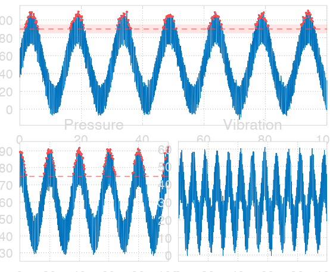

# FastSense

[](https://github.com/HanSur94/FastSense/actions/workflows/tests.yml)
[](https://hansur94.github.io/FastSense/dev/bench/)
[](https://codecov.io/gh/HanSur94/FastSense)
[](LICENSE)
[](https://www.mathworks.com/products/matlab.html)
[](https://octave.org)

Sensor monitoring and dashboarding platform for MATLAB and GNU Octave. Plot 100M+ points at 200+ FPS, define state-dependent thresholds, detect events in real time, and build interactive dashboards — all without toolbox dependencies.

<p align="center">
  
</p>

## Quick Start

```matlab
setup;  % adds libraries to path + compiles MEX

x = linspace(0, 100, 1e7);
y = sin(x) + 0.1 * randn(size(x));

fp = FastSense('Theme', 'dark');
fp.addLine(x, y, 'DisplayName', 'Sensor');
fp.addThreshold(0.8, 'Direction', 'upper', 'ShowViolations', true);
fp.render();
```

## The Five Pillars

### FastSense — Ultra-Fast Time Series Engine

The core plotting engine. Renders 10M+ data points with automatic downsampling (MinMax and LTTB), dynamic thresholds, and interactive zoom/pan — all at 200+ FPS.

```matlab
fp = FastSense('Theme', 'dark');
fp.addLine(x, y, 'DisplayName', 'Noisy Sine');
fp.addThreshold(2.0, 'Direction', 'upper', 'ShowViolations', true, ...
    'Color', 'r', 'Label', 'Alarm Hi');
fp.addThreshold(-2.0, 'Direction', 'lower', 'ShowViolations', true, ...
    'Color', 'r', 'Label', 'Alarm Lo');
fp.render();
```

**Local benchmarks** (Apple M4, GNU Octave 11, 10M points, MEX+NEON):

| Operation | Time |
|---|---|
| MinMax downsample | 7.4 ms |
| Full zoom cycle (2 thresholds) | 4.7 ms |
| Effective zoom FPS | **212 FPS** |
| Point reduction | 99.96% |
| GPU memory | 0.06 MB vs 153 MB for `plot()` |

**CI benchmarks** (Ubuntu, Octave 8.4, 1M points, MEX without SIMD):

| Operation | Time |
|---|---|
| MinMax downsample | ~2.1 ms |
| Binary search | ~100 us |
| Zoom cycle | ~26 ms |

Performance is tracked on every commit — regressions trigger alerts. [Live benchmark charts](https://hansur94.github.io/FastSense/dev/bench/)

- **Smart downsampling** — per-pixel MinMax and LTTB, auto-selected per zoom level
- **MEX acceleration** — optional C with SIMD (AVX2/NEON), auto-fallback to pure MATLAB
- **Linked axes** — synchronized zoom/pan across subplots
- **Datetime support** — datenum and MATLAB datetime with auto-formatting
- **6 built-in themes** — dark, light, industrial, scientific, ocean, colorblind
- **SQLite-backed storage** — disk-backed DataStore for 100M+ datasets exceeding memory

### SensorThreshold — State-Dependent Sensor Modeling

Bundles time-series data with discrete system states and condition-based threshold rules. A running machine has different alarm limits than an idle one — SensorThreshold models exactly that.

```matlab
s = Sensor('pressure', 'Name', 'Chamber Pressure', 'ID', 101);
s.X = t;  s.Y = pressure_data;

sc = StateChannel('machine_state');
sc.X = [0 25 50 75];  sc.Y = [0 1 2 1];  % idle→running→error→running
s.addStateChannel(sc);

s.addThresholdRule(struct('machine_state', 1), 55, ...
    'Direction', 'upper', 'Label', 'HH (running)');
s.resolve();
```

- **State channels** — discrete system states (idle, running, error) as zero-order-hold lookups
- **Condition-based rules** — thresholds that activate only when conditions match
- **Automatic violation grouping** — pre-computed during `resolve()`
- **Sensor registry** — predefined sensor catalog for quick setup

### EventDetection — Violation Detection & Live Pipeline

Groups threshold violations into discrete events with statistics, live monitoring, and notifications. Detects when sensors exceed limits, how long, and how severe.

```matlab
cfg = EventConfig();
cfg.MinDuration = 0.5;
cfg.addSensor(sTemp);
cfg.addSensor(sPres);
cfg.setColor('temp warning', [1.0 0.8 0.0]);
events = cfg.runDetection();
```

- **Event grouping** — consecutive violations merged into events with debouncing
- **Statistics** — peak, mean, RMS, std, duration automatically computed per event
- **Live pipeline** — real-time file polling with streaming event detection
- **Gantt viewer** — interactive timeline UI for event exploration
- **Notifications** — event-triggered callbacks for alerting

### Dashboard — Widget-Based Dashboard Engine

Build monitoring dashboards from composable widgets on a 24-column grid. Supports live data, JSON persistence, and 8 widget types.

```matlab
d = DashboardEngine('Process Monitoring');
d.Theme = 'light';
d.addWidget('fastsense', 'Position', [1 1 16 8], 'Sensor', sTemp);
d.addWidget('number',    'Position', [17 1 8 4], 'Sensor', sTemp, ...
    'Label', 'Temperature');
d.addWidget('gauge',     'Position', [17 5 8 4], 'Sensor', sPres, ...
    'Label', 'Pressure');
d.render();
d.save('dashboard.json');
```

- **8 widget types** — fastsense, number, status, gauge, table, text, timeline, rawaxes
- **24-column grid** — flexible positioning with `[col, row, width, height]` tuples
- **JSON persistence** — save/load complete dashboard configurations
- **Live mode** — synchronized data refresh across all widgets

### WebBridge — Browser-Based Visualization

Exposes dashboards to a web frontend over TCP. MATLAB stays the data engine; the browser handles rendering.

```matlab
bridge = WebBridge(dashboard);
bridge.serve();
bridge.registerAction('update_threshold', @myCallback);
```

- **TCP server** — bridges MATLAB dashboard to web/Electron frontend
- **Bidirectional callbacks** — actions and data-change notifications between MATLAB and browser
- **HTML5 charts** — uPlot-based rendering in the browser

## Installation

```bash
git clone https://github.com/HanSur94/FastSense.git
cd FastSense
```

Then in MATLAB or Octave:

```matlab
setup;  % adds paths + compiles MEX accelerators (requires C compiler)
```

No toolbox dependencies. MEX compilation is optional — pure MATLAB fallbacks are used automatically if no C compiler is available.

**Requirements:** MATLAB R2020b+ or GNU Octave 7+

## Documentation

Full documentation is available in the [Wiki](https://github.com/HanSur94/FastSense/wiki):

- [Getting Started](https://github.com/HanSur94/FastSense/wiki/Getting-Started) — tutorial with examples
- [API Reference: FastSense](https://github.com/HanSur94/FastSense/wiki/API-Reference:-FastSense) — core plotting class
- [API Reference: Dashboard](https://github.com/HanSur94/FastSense/wiki/API-Reference:-Dashboard) — layouts, widgets, engine
- [API Reference: Sensors](https://github.com/HanSur94/FastSense/wiki/API-Reference:-Sensors) — sensor system
- [API Reference: Event Detection](https://github.com/HanSur94/FastSense/wiki/API-Reference:-Event-Detection) — event pipeline
- [Architecture](https://github.com/HanSur94/FastSense/wiki/Architecture) — render pipeline, data flow
- [MEX Acceleration](https://github.com/HanSur94/FastSense/wiki/MEX-Acceleration) — SIMD details
- [Performance](https://github.com/HanSur94/FastSense/wiki/Performance) — benchmarks

## Examples

See the [`examples/`](examples/) directory for 40+ runnable scripts covering basic plotting, dashboards, sensors, event detection, live mode, and disk-backed storage. A categorized guide is in the [wiki](https://github.com/HanSur94/FastSense/wiki/Examples).

## Citation

If you use FastSense in your research, please cite it:

```bibtex
@software{fastsense,
  author = {Suhr, Hannes},
  title = {FastSense: Sensor Monitoring and Dashboarding for MATLAB and GNU Octave},
  url = {https://github.com/HanSur94/FastSense},
  license = {MIT}
}
```

See [`CITATION.cff`](CITATION.cff) for the full citation metadata.

## License

[MIT](LICENSE) — Hannes Suhr
