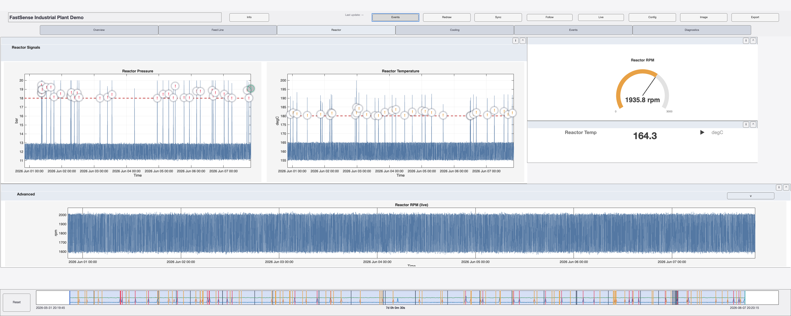
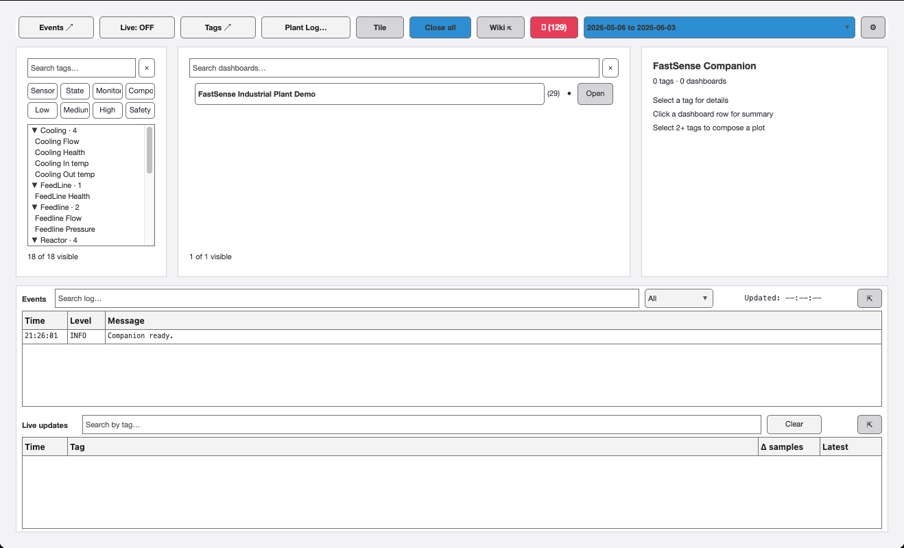

<div align="center">

<a href="https://github.com/HanSur94/FastSense"></a>

# FastSense

**Sensor data, at the scale you actually have it — in MATLAB.**

[](https://github.com/HanSur94/FastSense/actions/workflows/tests.yml) [](https://hansur94.github.io/FastSense/dev/bench/) [](https://codecov.io/gh/HanSur94/FastSense) [](LICENSE) [](https://www.mathworks.com/products/matlab.html) [](https://octave.org) [](#install)

`100M+ points` · `Tags` · `live event detection` · `21 dashboard widgets` · `no toolboxes`

</div>

FastSense is a pure-MATLAB platform for working with massive sensor time-series. Plot 100M+ points without crashing, model sensors as **Tags** with state-aware behaviour, detect events as they happen, and compose interactive dashboards — all without a single toolbox license.

Built for engineers who deal with real industrial data: long recordings, condition-dependent alarm limits, dashboards that need to stay live for hours, and the moment when MATLAB's own `plot()` falls over at 10M points.

---

## See it in action

A six-page industrial-plant dashboard and the live **FastSense Companion** — driven by the same Tags.

<p align="center"></p>

<p align="center"><b>FastSense Companion</b> — searchable tag catalog · dashboard list · live inspector</p>

<p align="center"></p>

---

## 30 seconds in

```matlab
install;   % run once: adds paths + builds MEX accelerators

x = linspace(0, 100, 1e7);              % 10 million points
y = sin(x) + 0.1 * randn(size(x));

fp = FastSense('Theme', 'dark');
fp.addLine(x, y, 'DisplayName', 'Sensor');
fp.addThreshold(0.8, 'Direction', 'upper', 'ShowViolations', true);
fp.render();
```

That renders in **a few milliseconds and stays at 200+ FPS while you zoom and pan**. MATLAB's built-in `plot()` takes ~3 seconds on the same data and crawls at ~2 FPS. ([benchmarks ↓](#performance))

---

## The core idea: Tags

Everything in FastSense — sensors, machine states, alarms, derived signals — is a **Tag**. One unified type, four flavours:

| Tag            | What it is                                                  |
|----------------|-------------------------------------------------------------|
| `SensorTag`    | A measured time-series (pressure, temperature, …)           |
| `StateTag`     | A discrete system state (idle / running / fault, recipe)    |
| `MonitorTag`   | A derived 0/1 alarm signal — "is this sensor out of spec?"  |
| `CompositeTag` | An aggregation of other tags                                |

Tags carry their own metadata (units, criticality, labels) and live in a shared **`TagRegistry`** so every part of the system — plots, dashboards, event detection, the web bridge — speaks the same language.

```matlab
t = linspace(0, 100, 1e5);                          % your sensor's timestamps
pressure_data = 50 + 8*sin(t/5) + randn(size(t));   % ...and its readings

press = SensorTag('press_a', 'Name', 'Chamber Pressure', 'Units', 'bar');
press.updateData(t, pressure_data);

% Alarm whenever pressure > 55 bar
alarm = MonitorTag('press_high', press, @(x, y) y > 55);

TagRegistry.register('press_a', press);
TagRegistry.register('press_high', alarm);

fp = FastSense();
fp.addTag(press);
fp.addTag(alarm);     % overlaid as a 0/1 step trace
fp.render();
```

The same `alarm` tag drives event detection, lights up status widgets in the dashboard, fires notifications, and shows up in the browser bridge — without you re-declaring the rule four times. For monitors that depend on multiple parents (e.g., a state-conditional alarm), compose them via `CompositeTag`.

---

## Build a dashboard

Compose monitoring dashboards from widgets on a 24-column grid. The same Tags drive the data — no re-wiring.

```matlab
d = DashboardEngine('Process Monitor');
d.Theme = 'dark';
d.addWidget('fastsense', 'Position', [1 1 16 8],  'Tag', press);
d.addWidget('number',    'Position', [17 1 8 4],  'Tag', press, 'Title', 'Pressure');
d.addWidget('gauge',     'Position', [17 5 8 4],  'Tag', press, 'Title', 'Live');
d.addWidget('status',    'Position', [1 9 24 2],  'Tag', alarm, 'Title', 'Alarm');
d.render();

d.save('process.json');           % JSON-persist
% later:  d = DashboardEngine.load('process.json');
```

- **21 widget types** — plots, numbers, gauges, status lights, gantt timelines, heatmaps, tables, markdown, …
- **Multi-page tabs · collapsible groups · pop-out detached widgets**
- **Live mode** — synchronised refresh on a configurable timer
- **Browser bridge** — `WebBridge(d).serve()` exposes the dashboard over TCP to a FastAPI + uPlot frontend

---

## Performance

FastSense vs. MATLAB's built-in `plot()` on 10M data points:

|                  | `plot()`   | FastSense                   |
|------------------|------------|-----------------------------|
| Render time      | ~3.2 s     | **4.7 ms**                  |
| Memory           | 153 MB     | **0.06 MB**                 |
| Zoom/pan FPS     | ~2 FPS     | **212 FPS**                 |
| Points displayed | 10 000 000 | ~400 (visually identical)   |

<sub>MacBook Pro M1 Pro · GNU Octave 11 · MEX + NEON. Tracked on every commit; regressions trigger alerts. <a href="https://hansur94.github.io/FastSense/dev/bench/">Live benchmark charts</a></sub>

The trick: per-pixel **MinMax** and **LTTB** downsampling (SIMD C kernels with pure-MATLAB fallbacks), an SQLite-backed disk store for datasets that don't fit in RAM, and a render pipeline that only touches the points you can actually see.

---

## What's in the box

- **Plotting engine** — 100M+ point time-series, 6 themes, linked axes, datetime support, optional MEX SIMD kernels
- **Tag domain model** — `SensorTag`, `StateTag`, `MonitorTag`, `CompositeTag`, shared `TagRegistry`
- **Event detection** — group violations into events, statistics, live pipeline, interactive Gantt viewer, notifications
- **Dashboards** — 21 widget types, JSON persistence, multi-page, collapsible, detachable, live refresh
- **Browser bridge** — TCP → FastAPI → uPlot, bidirectional callbacks
- **Disk-backed storage** — SQLite chunks with WAL for live reads, pyramid-cached downsamples
- **Pure MATLAB / Octave** — no toolboxes, no internet, no licenses

---

## Install

```bash
git clone https://github.com/HanSur94/FastSense.git
cd FastSense
```

Then in MATLAB or Octave:

```matlab
install;   % adds paths + compiles MEX accelerators
```

MEX is optional — pure-MATLAB fallbacks kick in if no C compiler is available. Requires MATLAB R2020b+ or GNU Octave 7+ on Linux, macOS, or Windows.

---

## Examples & docs

40+ runnable scripts in [`examples/`](examples/), grouped by topic (`01-basics` … `07-advanced`). Run them all with `run_all_examples`.

Full reference lives in the [Wiki](https://github.com/HanSur94/FastSense/wiki): Getting Started · API Reference · Architecture · MEX details · Performance.

---

## Citation · License

```bibtex
@software{fastsense,
  title  = {FastSense: Sensor Monitoring and Dashboarding for MATLAB and GNU Octave},
  url    = {https://github.com/HanSur94/FastSense},
  license= {MIT}
}
```

See [`CITATION.cff`](CITATION.cff) for the full citation metadata.

Released under the [MIT License](LICENSE).
