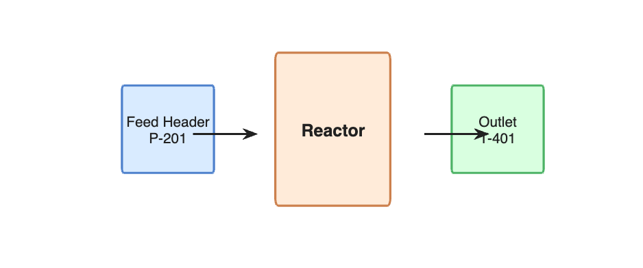

# Process Monitoring Dashboard — Line 4

## Overview

This dashboard monitors **temperature** and **pressure** sensors on
production Line 4. It is designed for shift operators and maintenance
engineers to quickly assess process health.

## Sensors

- **T-401 (Temperature)** — Thermocouple on reactor outlet.
  Normal range: 65--80 C. High alarm at 85 C.
- **P-201 (Pressure)** — Pressure transmitter on feed header.
  Normal range: 30--65 bar. High alarm at 70 bar.

## Thresholds

| Sensor | Level     | Value  | Condition        |
|--------|-----------|--------|------------------|
| T-401  | Hi Warn   | 78 C   | Machine running  |
| T-401  | Hi Alarm  | 85 C   | Machine running  |
| T-401  | Idle Hi   | 73 C   | Machine idle     |
| P-201  | Hi Warn   | 65 bar | Always           |
| P-201  | Hi Alarm  | 70 bar | Always           |

## Operating Notes

- Temperature spikes during startup are expected and typically settle
  within 10 minutes.
- If pressure exceeds 65 bar for more than 5 minutes, check the feed
  valve PV-201.
- Contact the process engineer (ext. 4412) for sustained alarms.

## Process Diagram

## Data Sources

All sensor data is sampled at 10 Hz and stored in the historian.
The dashboard refreshes every 5 seconds in live mode.

---

*Last updated: 2026-03-18*
